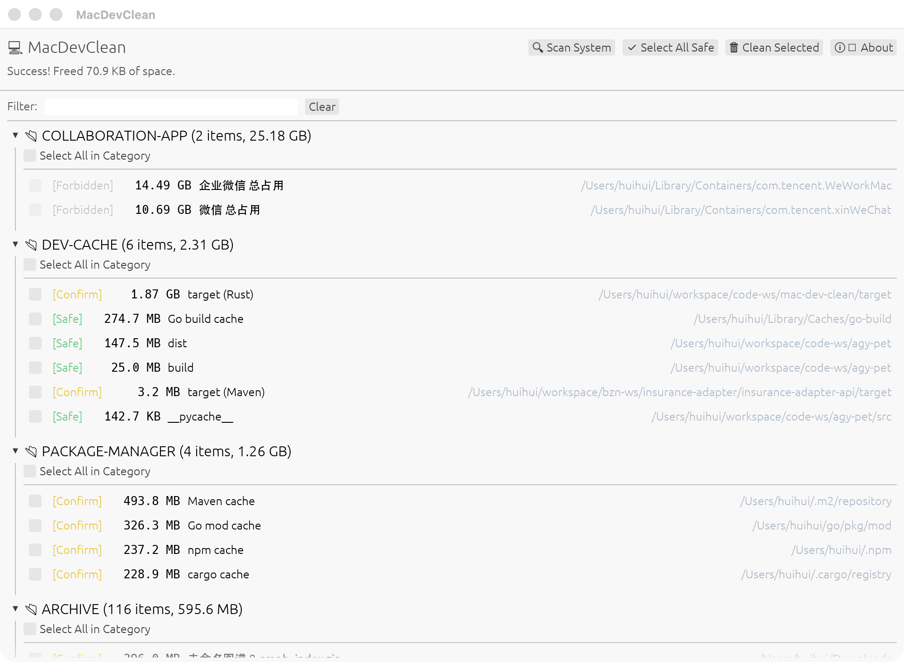

#  MacDevClean

**The Safest and Fastest Cache Cleaner for macOS Developers.**



MacDevClean is a native, ultra-lightweight macOS utility designed specifically for developers. It safely and precisely reclaims gigabytes of disk space by targeting hidden development caches (Node, Python, Go, Java, Docker, AI Models) and collaboration app workspaces (WeChat, WeCom, DingTalk, Feishu, QQ), **without ever risking your core application data or source code**.

## ✨ Why MacDevClean?

Unlike generic cleaners that blindly delete files or bloated Electron apps that consume hundreds of megabytes of RAM, MacDevClean is:

1. **Trash-First Safety**: We **NEVER** permanently delete files. Everything is moved to your macOS Trash by default. If a cache deletion breaks your workflow, simply hit "Put Back" in your Trash bin.
2. **Pure Native UI**: Built with Rust and `egui`, the application compiles to a single, lightning-fast native binary utilizing Metal hardware acceleration. Zero Chromium overhead.
3. **Developer Focused**: Intelligently identifies `node_modules`, Python caches, Go build caches, Maven repository caches, Gradle caches, Docker volumes, `npm` caches, and HuggingFace AI models.
4. **Chat App Workspace Analysis**: Deeply understands the workspace sizes of WeChat, WeCom, DingTalk, Feishu, and QQ. These are kept strictly read-only (`RiskLevel::Forbidden`) to show you exactly how much disk space they consume, with zero risk of accidental data loss.

## 🚀 Installation

### Option 1: Download DMG (Recommended)
1. Go to the [Releases](https://github.com/aning35/mac-dev-clean/releases) page.
2. Download the latest `MacDevClean.dmg`.
3. Open the DMG and drag `MacDevClean.app` to your Applications folder.

### Option 2: Build from Source
Ensure you have [Rust](https://rustup.rs/) installed:
```bash
git clone https://github.com/aning35/mac-dev-clean.git
cd mac-dev-clean
cargo run --release -- ui
```

## 🛠 Features

### 1. Granular Developer Scanners
- **Node.js**: `node_modules`, `npm` cache, `yarn` cache, `.next`, `.vite`, `dist`, `build`.
- **Python**: `__pycache__`, `.pytest_cache`, `.venv`, `.tox`.
- **Rust**: Project build outputs (`target` directory under Cargo projects).
- **Go**: Go build cache (`~/Library/Caches/go-build`), Go dependency modules (`~/go/pkg/mod`).
- **Java**: Maven Dependency Repository (`~/.m2/repository`), Gradle caches (`~/.gradle/caches`), Maven project build outputs (`target` directory under Maven projects).
- **Docker**: Scans unused images, stopped containers, and dangling volumes.
- **AI Models**: HuggingFace (`~/.cache/huggingface/hub`) and Ollama models.
- **iOS/macOS**: Xcode DerivedData, Archives, CocoaPods cache.
- **IDEs**: JetBrains `.idea` / system caches, VS Code `.vscode`.

### 2. Intelligent Guard Lists
MacDevClean refuses to delete sensitive files. Our core engine intercepts and blocks deletions of:
- Source code roots (`.git`)
- Environment variables (`.env`, `.env.local`)
- Credentials (`*.pem`, `*.key`, `*.p12`)
- Databases (`*.sqlite`, `*.db`, `*.wal`, `*.shm`)
- Cloud/System configs (`~/.aws`, `~/.ssh`, `/System`, `/etc`)

### 3. Native UI with Actionable Analytics
- **Dynamic Size Units**: Sizes are formatted using the most readable unit (`GB`, `MB`, `KB`, or `B`) and displayed in clean monospace.
- **Dynamic Group Sorting**: Categories are automatically sorted by their total occupied space descending, showing the largest disk space consumers at the very top.
- **Row-Level Selection**: Click anywhere on a row to select or deselect it (no need to click the small checkbox directly).
- **Right-Click Context Menu**: Right-click any item row to:
  - `📋 Copy Full Path` to your system clipboard.
  - `📂 Reveal in Finder` to open the containing folder and highlight the item.
- **Center-Anchored About Dialog**: Sleek native popup displaying version details and project links.

## 📖 Usage

### GUI Mode
Launch the application, or run from the CLI:
```bash
macdevclean ui
```
Click **Scan System**, select the categories you want to reclaim, and click **Clean Selected**.

### CLI Mode
For terminal enthusiasts, MacDevClean provides a powerful CLI:
```bash
# Scan and view a summary
macdevclean scan

# Interactive terminal cleanup
macdevclean clean

# Export scan results as JSON
macdevclean scan --json > report.json
```

## 🤝 Contributing
Contributions, issues, and feature requests are welcome! Feel free to check the [issues page](https://github.com/aning35/mac-dev-clean/issues).

## 📄 License
MIT License.
